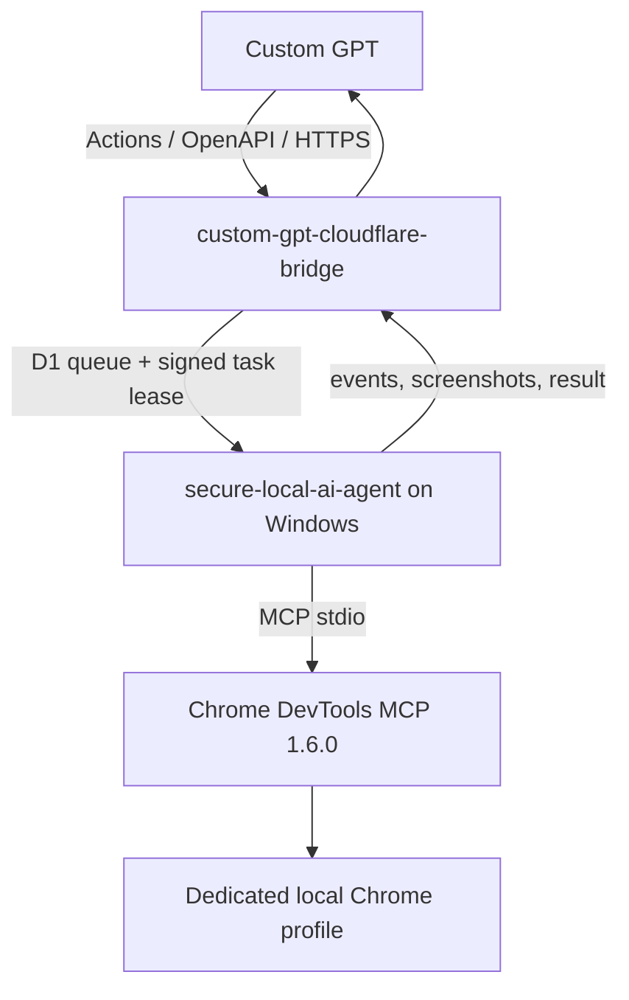

# Deprecated validation harness — Custom GPT Chrome MCP

> **This repository is not the production runtime.** It was created from an incorrect direct REST-wrapper design and is retained only for public documentation and contract validation.

## Correct production architecture

Production implementation locations:

- `univcorp2-ctrl/custom-gpt-cloudflare-bridge/browser-actions/`
- `univcorp2-ctrl/secure-local-ai-agent/browser-runtime/`

Custom GPT registers the Cloudflare REST/OpenAPI Actions. It does **not** register or launch Chrome MCP directly. Chrome DevTools MCP runs inside the Windows resident local agent.

This public repository validates the five Actions endpoints, approval classification, HMAC task signatures, local domain enforcement, and availability of `chrome-devtools-mcp@1.6.0`.
