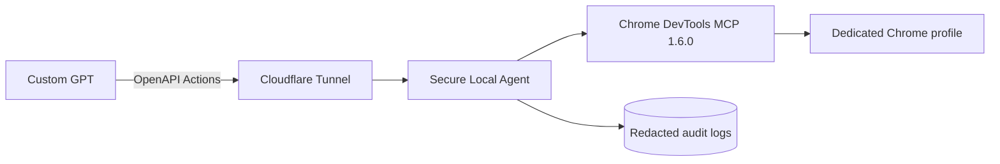

# Custom GPT Chrome DevTools MCP Agent

[](https://github.com/univcorp2-ctrl/custom-gpt-chrome-mcp-agent/actions/workflows/ci.yml)

Custom GPTから実際のChromeを安全に操作・検査するためのローカルHTTPSブリッジです。Google Chrome公式の `chrome-devtools-mcp@1.6.0` をJSON-RPC stdioで起動し、Custom GPT Actionsからページ操作、DOMスナップショット、Console、Network、Lighthouse、Performance、メモリ解析を呼び出せます。


## 完成構成



## Start

```bash
cp .env.example .env
# URL_SECRET、AGENT_API_TOKEN、ALLOWED_HOSTSを設定
docker compose up -d --build
```

公開後、GPT Builderへ次のOpenAPI URLを登録します。

```text
https://YOUR_HOSTNAME/t/YOUR_URL_SECRET/openapi.json
```

Actions Authenticationは `None` にします。GitHub Token、Google Token、Cloudflare TokenをCustom GPTへ入力しません。

## Security defaults

- 日常用Chromeとは別の専用プロファイル。
- ドメイン許可リストをアプリ層とChrome MCP層で二重強制。
- `evaluate_script`、拡張機能変更、WebMCP実行、ファイルアップロードは既定拒否。
- `--no-usage-statistics`、`--no-performance-crux`、Networkヘッダー秘匿を強制。
- 全呼び出しを機密値マスキング済みJSONLへ記録。
- Tunnel以外からポート8788を公開しない。

## API

- `GET /health`: 公開最小ヘルスチェック。
- `GET /t/{URL_SECRET}/health`: ポリシーを含む認証済みヘルスチェック。
- `GET /t/{URL_SECRET}/openapi.json`: Custom GPT用の動的OpenAPI schema。
- `GET /t/{URL_SECRET}/v1/tools`: 許可済みMCPツール一覧。
- `POST /t/{URL_SECRET}/v1/call`: MCPツール実行。
- `POST /v1/call/{base64url-json}`: Bearer認証Worker向けbody-free互換経路。

## Documentation

- [Initial setup](docs/setup.md)
- [Architecture](docs/architecture.md)
- [Agent instructions](CODEX.md)

## Production readiness

本番運用には、常時起動するPCまたは小型サーバー、安定版Chrome、Cloudflare named Tunnel、専用Chromeアカウント、限定した許可ドメインが必要です。購入、削除、公開、金融操作を行うサイトは許可リストへ追加しないでください。
