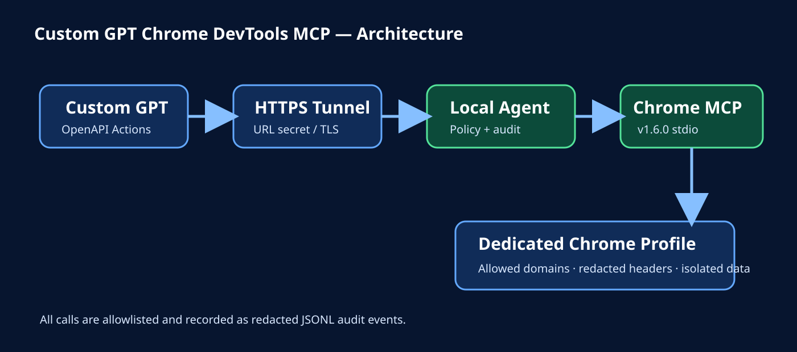
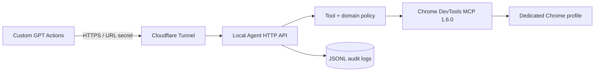

# Architecture

## Trust boundaries

1. **Custom GPT → Tunnel**: TLS and an unguessable URL secret. Custom GPT Actions Authentication can remain `None`; the secret is part of the server URL.
2. **Tunnel → Local Agent**: the tunnel only routes to the local container. The agent also supports a separate Bearer token for a Cloudflare Worker relay.
3. **Agent → MCP**: only allowlisted Chrome DevTools MCP tools are accepted. URLs are checked before tool execution.
4. **MCP → Chrome**: Chrome uses a dedicated persistent profile, not the daily browser profile.

## Processing flow

The agent authenticates the request, validates the tool class and every HTTP(S) URL in its arguments, calls Chrome DevTools MCP over JSON-RPC stdio, redacts sensitive audit fields, and returns the MCP result. Extension changes, JavaScript evaluation, WebMCP execution, and file upload are disabled by default.

## Secrets

- `URL_SECRET`: direct Custom GPT Actions URL secret.
- `AGENT_API_TOKEN`: optional Worker-to-agent Bearer token.
- `CLOUDFLARED_TUNNEL_TOKEN`: named Cloudflare Tunnel token.

No GitHub, Google, or Cloudflare API token belongs in the Custom GPT itself.
